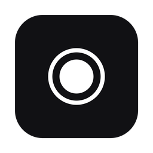

<p align="center">
  
</p>

<h1 align="center">RTI</h1>

<p align="center"><strong>A Mac meeting recorder with live transcription and a real-time copilot.</strong></p>

<p align="center">
  
  
  
</p>

RTI listens to both sides of a call, shows a live transcript, and lets you ask
an AI about the meeting while it is still going. When you stop, it saves the
transcript, a summary and the audio as plain files on your Mac. It is for
people who sit in meetings, interviews and fieldwork sessions and want notes
they own. RTI stands for Real-Time Intelligence.

> **Free and open source.** RTI is free to use, change and share under the MIT License.
> No account, no subscription, no telemetry. RTI is not an offline app: live audio goes to Soniox, and your prompts and transcript go to the AI provider you pick. See [Privacy](#privacy).

## Features

- **Live transcription of both sides.** Your microphone and the system audio (the other party) are transcribed as two legs, in real time, by [Soniox](https://soniox.com). RTI hints English and Chinese to the recognizer, and adds the languages you pick for translation. Soniox decides what it hears.
- **A copilot over the live transcript.** `Command+Return` runs the main action over the last few minutes. Quick recap is the default. Other actions are Assist, Say next, Follow-ups, and, for interviews, Key tensions, What's unsaid and Emerging themes. The set follows your mode.
- **A window that stays out of screen shares.** RTI is a normal Mac window with its sharing type set to none. It is hidden from screen sharing and from `screencapture` by default. Some recorders may still see it, so test yours. A toggle in Settings turns this off.
- **Clear recording states.** The record control shows Recording, Paused, Saving, Summarizing and Notes ready. Pause keeps the connection warm, so resume is instant. You can start a new recording while the last summary is still being written.
- **Live notes, discussion guide and findings.** Optional tabs write meeting notes, track coverage of a discussion guide you import, and collect tagged findings as the call runs.
- **Screenshots.** One key reads the whole screen and another reads the front window. Text is read on your Mac with Apple Vision. The image is sent to your model when it takes image input. Windows you put on the privacy list are left out.
- **Translation.** Optional live translation next to the transcript, one way or two ways.
- **Modes.** Meeting, Interview, Coding and Custom prompt presets, with optional reference text for each.
- **Sessions window.** Browse saved sessions, replay the mic and system audio together, copy or share a document, and move a session to Trash.
- **Saved chats.** Search, pin, rename, export and delete past chats. Nothing is pruned automatically. This needs a notes folder (see [Optional integrations](#optional-integrations)).

## Requirements

- macOS 14 (Sonoma) or later on Apple Silicon. The audio-only system tap needs macOS 14.2. On 14.0 and 14.1, RTI falls back to ScreenCaptureKit and needs Screen Recording permission for system audio.
- A [Soniox](https://console.soniox.com) API key. Live transcription does not work without it.
- A key for one assistant provider: [DeepSeek](https://platform.deepseek.com), [OpenAI](https://platform.openai.com/api-keys) or [OpenRouter](https://openrouter.ai/keys). DeepSeek is the default.
- To build from source: Xcode 16 or later (Swift 6), [XcodeGen](https://github.com/yonaskolb/XcodeGen), and a clone of [Quick Launch](https://github.com/tristan-mcinnis/quick-launch) next to this repo. RTI builds the shared `HouseChatCore` package from it. See [Build from source](#build-from-source).

## Install

### Download

Get the latest `RTI-<version>-macos-arm64.dmg` from
[GitHub Releases](https://github.com/tristan-mcinnis/rti/releases/latest).
Open it and drag RTI to Applications. Each release lists a SHA256 you can check
with `shasum -a 256 -c SHA256SUMS`.

#### First open (macOS will warn you)

RTI is not notarized. It is a free project, and it has no paid Apple Developer ID. So macOS blocks the first open. Only open it if you downloaded it from the Releases page of this repository.

1. Open the DMG and drag RTI to Applications.
2. Open RTI once. macOS says it cannot verify the app. Click Done.
3. Open System Settings, then Privacy & Security. Scroll down and click Open Anyway next to RTI. Confirm.

If you prefer Terminal, run this once, then open the app:

```bash
xattr -dr com.apple.quarantine "/Applications/RTI.app"
```

Each release is signed ad hoc. So macOS may ask again for permissions such as Microphone, System Audio Recording or Screen Recording after an update. Grant them again when asked.

### First run

1. Open RTI. It is a Dock app with a menu-bar recording indicator.
2. Paste your Soniox key and your assistant provider key in Settings, under Providers. The onboarding screen asks for them on the first launch.
3. Press `Command+Shift+R` to start a session. Press it again to finish.
4. Press `Command+Return` to ask the assistant for a recap. Press `Command+\` to show or hide the window.

### Permissions

macOS asks for each of these the first time a feature needs it.

| Permission | Used for |
|---|---|
| Microphone | Your side of the call. |
| System Audio Recording | The other side of the call, through a CoreAudio tap. |
| Screen Recording | Screenshots, and system audio on macOS 14.0 and 14.1. |
| Calendars | Read-only. Attaches the meeting title to a session. |
| Notifications | A notice when a session summary is ready. |
| Launch at Login | An option in Settings. macOS may refuse it for an ad hoc signed build. |

## Usage

Pick a mode in Settings, under Modes, then start a session with `Command+Shift+R`.
Ask the assistant with `Command+Return`, or open the menu to pick another
action. Type a note into the transcript with `Command+Option+N`. Drop an image
on the composer, or press `Command+Shift+H` to read the whole screen.

| Key | Action |
|-----|--------|
| ⌘ \\ | Show or hide the window |
| ⌘ ⇧ R | Start a session, finish it, or start a new one |
| ⌘ ⇧ P | Pause or resume the recording |
| ⌘ ↵ | Primary action. Remappable. Defaults to Quick recap |
| ⌘ ⌥ S | Say next (one-line draft reply) |
| ⌘ ⌥ F | Follow-up questions |
| ⌘ ⌥ R | Recap so far |
| ⌘ ⌥ M | Session summary |
| ⌘ ⌥ T | Key tensions (interview and listener mode) |
| ⌘ ⌥ U | What's unsaid (interview and listener mode) |
| ⌘ ⌥ E | Emerging themes (interview and listener mode) |
| ⌘ ⌥ N | Type a note inline into the transcript |
| ⌘ ⇧ H | Read the whole screen and attach the text to the next prompt |
| ⌘ ⇧ J | Read the front window and attach the text to the next prompt |
| ⌘ ⇧ A | Open the attachment menu |
| ⌘ K | Command palette |
| ⌘ ⌥ 0 to 5 | Jump to a tab: Setup, Assist, Transcript, Notes, Guide, Findings |

The source of truth for keys is `RTI/Sources/UI/CommandPalette/CommandPaletteFactory.swift`.

**Both sides of a call.** System audio is captured automatically. If you prefer an aggregate device, install [BlackHole](https://existential.audio/blackhole/), build an aggregate of your mic and BlackHole in Audio MIDI Setup, and pick it under Settings, General, Audio Input.

**Switching the assistant.** Settings, Providers lists DeepSeek, OpenAI and OpenRouter. The assistant client speaks the OpenAI-compatible chat format. To add another endpoint, add an entry in `RTI/Sources/LLM/LLMProvider.swift`.

**Recording and consent.** RTI records other people. Tell the people on the call, and follow the recording laws where you and they are.

## Privacy

**What RTI reads**

- Your microphone and the system audio, only while a session is recording.
- The screen, only when you press a screenshot key, or during a recording if you turn on screen capture.
- Calendar event titles, read-only, to name a session.
- Files and images you attach to a chat.
- A notes folder, if you set one up, when the assistant searches or reads it.

**What RTI sends, and where**

| To | What | When |
|---|---|---|
| Soniox | Live audio from your microphone and from the system audio. | During every recording. |
| Your assistant provider (DeepSeek, OpenAI or OpenRouter) | Your prompts, about the last six minutes of transcript for each assistant turn, the full transcript for the end-of-session summary and title, text chunks for live notes and guide coverage, attachments, and screenshots you add. Text read from a screenshot goes along with it. | When you use the assistant, and at the end of a session. |
| GitHub | A request for the latest release number. It carries no content. | At each normal launch, and when you choose Check for Updates. |

Two optional integrations send more. See [Optional integrations](#optional-integrations). RTI has no server of its own, no account and no analytics.

**What RTI stores**

- **Sessions.** One folder per session, with owner-only permissions, in `~/Library/Application Support/RTI/sessions/<date time>/`. It holds `transcript.md`, `summary.md`, `session.json`, and, when they exist, `chat.md`, `notes.md`, `discussion-guide.md`, `live-intelligence.md`, `screen-context.md` and a `frames/` folder of screenshots. It also holds `audio-mic.wav` and `audio-system.wav`, the raw audio of both legs. RTI keeps this audio until you delete the session. If you set a notes folder, sessions go there instead.
- **API keys.** In `~/Library/Application Support/RTI/credentials.json`, a plain JSON file readable only by you. RTI does not use the Keychain.
- **Chats.** Saved only when a notes folder is set. Without one, chats run but are not stored.
- **Other.** Your modes and a crash log in `~/Library/Application Support/RTI/`, and the `claude` run logs in `~/Library/Logs/RTI/` if you use that integration.

Delete a session in the Sessions window. It moves the folder to Trash.

## Optional integrations

These features work only when their tool is on your Mac. Without it, RTI skips the feature and carries on. Nothing else depends on them.

| Integration | What it needs | Without it |
|---|---|---|
| Notes folder ("vault") | A folder you choose, set as `recordings_dir` in `~/.config/rti/config.json`. RTI treats `<folder>/../..` as the notes root and saves sessions in `<notes root>/projects/personal/rti/sessions`. It also copies each transcript to `<notes root>/meetings/transcripts-raw`. | Sessions save in Application Support. Chats are not saved. The assistant's vault tools are unavailable. |
| Vault tools for the assistant | `bun` and a search tool inside your notes repo. | The assistant cannot search past notes. |
| Session router | A script named `route-rti-session.py` in your notes repo, under `.claude/tools/triage/`. | RTI skips it. |
| `/meeting` processor (`claude -p`) | `"auto_process": true` in the config file, a notes folder, the Claude Code command line tool (`claude`), and a `/meeting` skill that you wrote. | Nothing runs. It is off by default. See the warning below. |
| Transcript upgrade (file-transcriber) | A helper script named `transcribe-soniox.py` from a tool called file-transcriber. Set its path with `soniox_file_script` in the config file. It sends the retained audio to Soniox's file API, using your Soniox key. | RTI logs the failure, keeps the live transcript and the audio, and writes the summary from the live transcript. |
| Local vision | A local model server on `127.0.0.1:8078` that accepts `POST /v1/vision`, enabled by a `local_vision` block in the config file. Images go to that server and stay on your Mac. | RTI uses on-device text reading only. |

**Read this before you turn on the `/meeting` processor.** It is off by default. To turn it on, set `"auto_process": true` in the config file. Then, when a notes folder is set and `claude` is found, RTI runs `claude -p` in the background after each session. It passes the transcript path and a prompt, and it uses `--permission-mode acceptEdits`. That mode lets the run edit files without asking. To skip every permission prompt, also set `"auto_process_yolo": true`. That adds `--dangerously-skip-permissions`, so the run can change any file without asking; use it only if you accept that risk. The transcript is sent to Anthropic through your own Claude account. Without `auto_process`, or without a notes folder, this never runs.

The author's own setup is in [docs/personal-setup.md](docs/personal-setup.md).

## Build from source

```bash
mkdir house && cd house
git clone https://github.com/tristan-mcinnis/rti.git rti
git clone https://github.com/tristan-mcinnis/quick-launch.git quick-launch
cd rti/RTI
cp Sources/Secrets.swift.example Sources/Secrets.swift   # first checkout only, gitignored, holds no keys
xcodegen generate
xcodebuild -project RTI.xcodeproj -scheme RTI -configuration Debug build
```

The two folders must sit side by side. If `quick-launch` is missing, `xcodegen generate` stops and names the layout (`scripts/check-layout.sh`).

Run the checks and the tests from the repo root:

```bash
scripts/scrub.sh   # no personal paths, ids or keys in tracked files; must print SCRUB_CLEAN
xcodebuild -project RTI/RTI.xcodeproj -scheme RTI -configuration Debug -derivedDataPath .deriveddata test
```

That runs `RTITests` and `RTIRenderTests`. The tests that need a live notes folder skip unless `TEST_RUNNER_RTI_LIVE_VAULT=1` is set.

Package a DMG with `scripts/make-dmg.sh`. It builds with ad hoc signing, checks the image without launching the app, and writes the DMG, `SHA256SUMS` and `RELEASE_NOTES.md` to `dist/release`. It needs a clean working tree. It publishes nothing. A Developer ID holder can use `scripts/release.sh` and [RELEASE.md](RELEASE.md) for a notarized build.

A locally built app is ad hoc signed, so macOS asks for Microphone, System Audio Recording and Screen Recording again after each rebuild.

More reading: [docs/adr/](docs/adr/) holds architecture decision records, some from before the current design. [RTI/VERIFY.md](RTI/VERIFY.md) lists manual checks for a build.

## Part of House

RTI is one of a small family of free, local-first Mac tools that share one design system.

| App | What it does |
|---|---|
| [Quick Launch](https://github.com/tristan-mcinnis/quick-launch) | Keyboard-first launcher and instant AI overlay. |
| [Local Dictation](https://github.com/tristan-mcinnis/local-dictation) | Hold a key, talk, and on-device text lands at your cursor. |
| [Local TTS](https://github.com/tristan-mcinnis/local-tts) | Fast on-device voice cloning and text-to-speech. |
| [Local Models](https://github.com/tristan-mcinnis/local-models) | One local daemon that serves a fleet of small models to every app. |
| [Usage](https://github.com/tristan-mcinnis/usage-menubar) | One menu-bar gauge for every AI subscription and API key. |
| **[RTI](https://github.com/tristan-mcinnis/rti)** | Meeting recorder with live transcription and a real-time copilot. |

## Credits

RTI shares its chat core, `HouseChatCore`, with
[Quick Launch](https://github.com/tristan-mcinnis/quick-launch). That package
is MIT licensed and comes from Quick Launch, which began as a fork of
[apfel-quick](https://github.com/Arthur-Ficial/apfel-quick) by Arthur Ficial.
Thank you, Arthur.

RTI is built on these open-source Swift packages:

- [Starscream](https://github.com/daltoniam/Starscream) by Dalton Cherry (Apache-2.0), for the WebSocket link to Soniox.
- [Yams](https://github.com/jpsim/Yams) by JP Simard (MIT), for YAML front matter.
- [swift-markdown-ui](https://github.com/gonzalezreal/swift-markdown-ui) and [NetworkImage](https://github.com/gonzalezreal/NetworkImage) by Guille Gonzalez (MIT), for Markdown in answers and notes.
- [swift-cmark](https://github.com/swiftlang/swift-cmark), the cmark-gfm parser by John MacFarlane, GitHub and others (BSD-2-Clause, with MIT parts).

Transcription is by [Soniox](https://soniox.com). RTI ships no model weights, fonts or third-party icons.

Full license texts are in [THIRD_PARTY_NOTICES.md](THIRD_PARTY_NOTICES.md),
which also ships inside the app.

## License

MIT. See [LICENSE](LICENSE). Copyright (c) 2026 Tristan McInnis.
